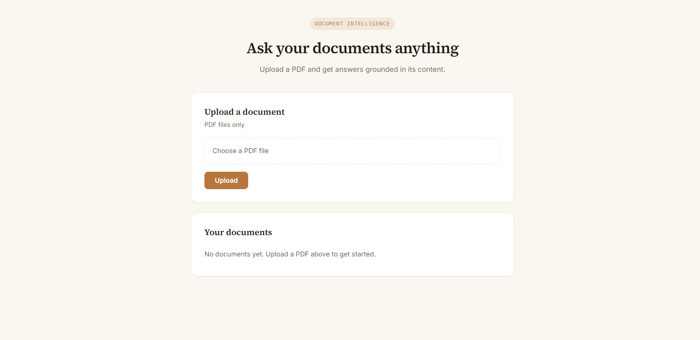
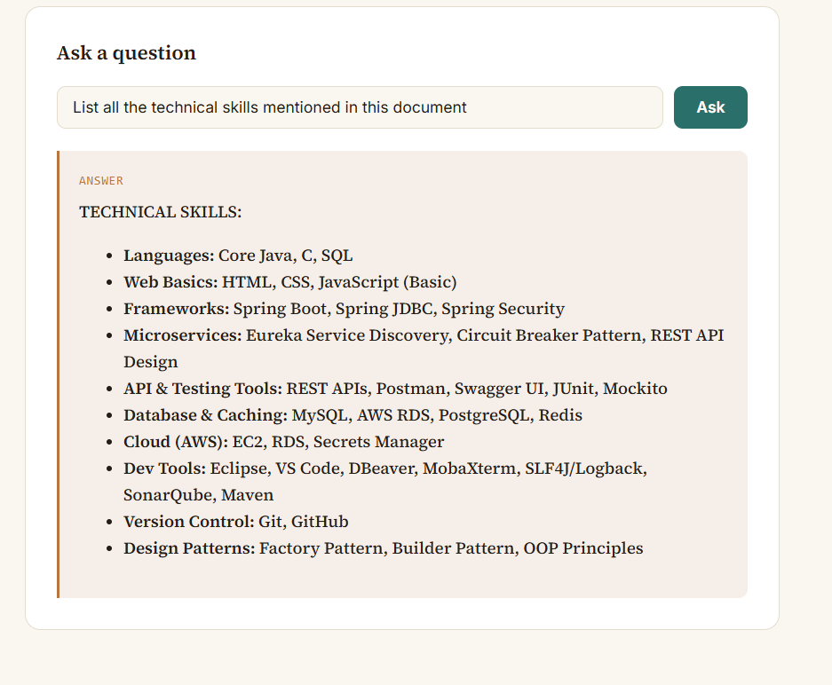

# AI Document Q&A — Frontend

This is the React frontend for the [AI Document Q&A System](https://github.com/pranalikadlak-17/ai-doc-qa) — a full-stack app that lets users upload a PDF and ask natural-language questions about it, powered by the Google Gemini API.

> This repo is the UI only. It needs the [Spring Boot backend](https://github.com/pranalikadlak-17/ai-doc-qa) running to work — see that repo for backend setup instructions.

## Tech Stack

- React (Vite)
- Axios for API calls
- React Markdown for rendering AI answers
- Plain CSS with a custom design system (no UI framework)

## Getting Started

1. Clone this repo.
2. Install dependencies:

npm install
3. Make sure the backend is running on `http://localhost:8080` (see backend repo for setup).
4. Start the dev server:
npm run dev
5. Open `http://localhost:5173` in your browser.

## Screenshots

### Home Page

### AI Answer

## Related

- [Backend repository](https://github.com/pranalikadlak-17/ai-doc-qa) — Spring Boot API, PDF text extraction, Gemini integration

## Author

**Pranali Kadlak**
[GitHub](https://github.com/pranalikadlak-17) | [LinkedIn](https://www.linkedin.com/in/pranali-kadlak-5ab5433a9)

